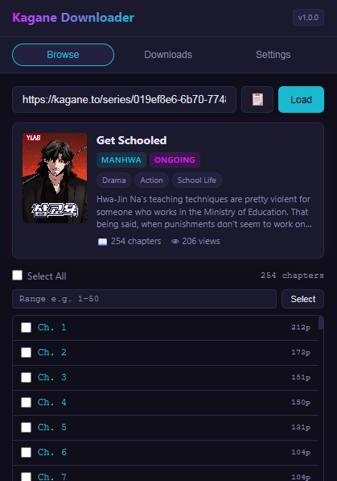

# Kagane Downloader Extension

[](https://opensource.org/licenses/MIT)
[](#)

A powerful, developer-friendly Chrome extension designed to download manga chapters directly from `kagane.to` with support for multiple high-quality output formats including raw Images, CBZ (Comic Book ZIP), and PDF.

---

## Preview



---

## Features

- **Multi-Format Export**: Convert and export downloaded chapters to:
  - **Images**: Raw images (`.jpg`/`.png`) in structured directories.
  - **CBZ**: Comic Book ZIP archives, ready for your favorite reader.
  - **PDF**: Single, high-quality document per chapter.
- **Smart Metadata Loading**: Paste any `kagane.to` series URL, reader URL, or Series ID to load chapter lists instantly.
- **Background Downloader**: Built on Chrome Extension Manifest V3 (MV3). Downloads run asynchronously in a Service Worker, preventing loss of progress even when closing the popup.
- **Secure Bypass & DNR Routing**: Utilizes `declarativeNetRequest` (DNR) rules to handle request headers (`Referer` and `Origin`), bypassing hotlinking protections on CDN hosts (e.g., `kstatic.to`, `yuzuki.kagane.to`, `akari.kagane.to`).
- **Concurrent Processing & Queue**: Configure chapter and page concurrency to balance speed and rate-limiting safety.
- **Dynamic Progress Tracking**: Live-updated progress bars, statuses, and history logs inside the extension popup.

---

## Installation

### Method 1: Prebuilt Release (Recommended)

1. Navigate to the [Releases](https://github.com/Yui007/kagane-extension/releases) page of the repository.
2. Download the latest `kagane-extension.zip`.
3. Extract the downloaded ZIP file to a preferred directory on your local machine.
4. Open Google Chrome and navigate to `chrome://extensions/`.
5. Enable **Developer mode** using the toggle switch in the top-right corner.
6. Click the **Load unpacked** button in the top-left corner.
7. Select the folder where you extracted the ZIP archive.

### Method 2: Build from Source

#### Prerequisites
- [Node.js](https://nodejs.org/) (v18 or higher recommended)
- [npm](https://www.npmjs.com/)

#### Steps
1. Clone the repository:
   ```bash
   git clone https://github.com/Yui007/kagane-extension.git
   cd kagane-extension
   ```
2. Install the project dependencies:
   ```bash
   npm install
   ```
3. Compile TypeScript and bundle the assets:
   ```bash
   # For production build
   npm run build

   # For development build (with file watch)
   npm run dev
   ```
4. Load the extension in Chrome:
   - Open `chrome://extensions/` and enable **Developer mode**.
   - Click **Load unpacked** and select the built `dist` directory.

---

## Architecture & Codebase Overview

```
kagane-extension/
├── public/
│   ├── manifest.json      # Extension configuration and permission rules
│   ├── icons/             # Custom extension icons (16x16, 48x48, 128x128)
│   └── content-reader.js  # Script injected into reader tabs to query DRM assets
├── src/
│   ├── api/
│   │   ├── client.ts      # Fetch-based API client with auto-retries and backoff
│   │   └── types.ts       # Types and normalization logic for Kagane responses
│   ├── background/
│   │   ├── download-queue.ts  # Class managing parallel chapter job queues
│   │   ├── image-downloader.ts# Downloads images, converts to blobs/data URLs
│   │   └── settings.ts    # Manages user-defined concurrency & format settings
│   └── background.ts      # Main MV3 service worker router and tab manager
├── popup/
│   ├── popup.html         # Main user interface markup
│   ├── popup.css          # Styling for popup tabs, lists, and forms
│   └── popup.ts           # Controls UI actions, updates progress, saves settings
├── offscreen/             # Offscreen document for heavy processing operations
└── vite.config.ts         # Vite bundler configuration
```

---

## Configuration Settings

Accessible via the **Settings** tab in the extension popup:
- **Download Format**: Select between raw Images, CBZ, and PDF formats.
- **Max Concurrent Chapters**: Controls how many chapters are processed in parallel (1-5, default: `3`).
- **Max Concurrent Images**: Controls how many image pages are fetched in parallel per chapter (1-10, default: `5`).

---

## Development & Tech Stack

- **Core**: HTML5, Vanilla CSS, TypeScript.
- **Bundler**: [Vite](https://vitejs.dev/) with Rollup.
- **Libraries**:
  - [JSZip](https://stuk.github.io/jszip/) (for packaging CBZ files).
  - [jsPDF](https://github.com/parallax/jsPDF) (for generating PDF files).
- **Linter & Type Checker**: TypeScript compiler (`tsc --noEmit`).

---

## License

This project is licensed under the MIT License. See the [LICENSE](LICENSE) file for more details.
